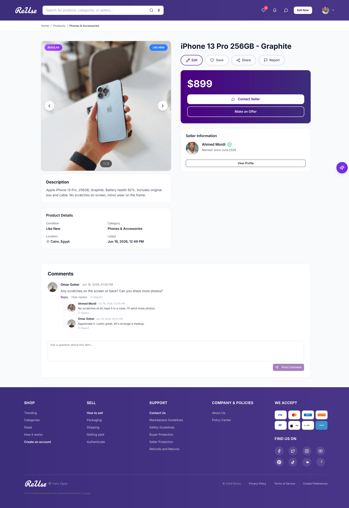
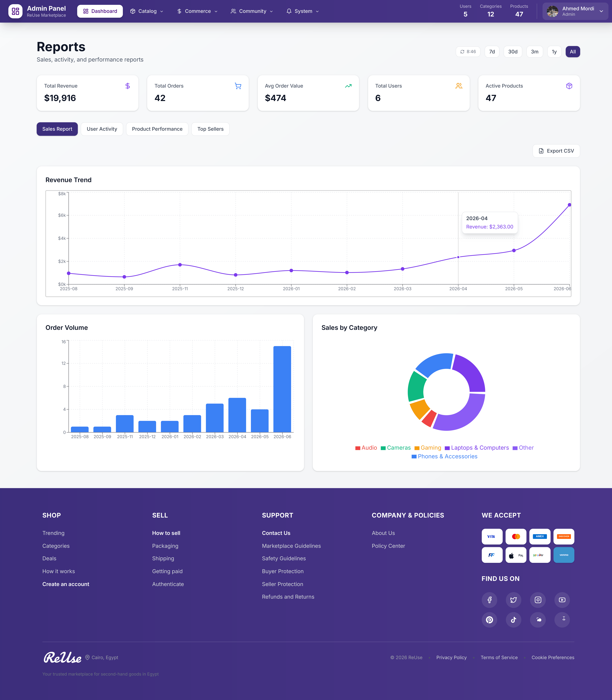

# ReUse

A sustainable secondhand marketplace where users buy, sell, and swap used items to extend product life cycles and reduce waste. ReUse supports three listing models (Regular sale, Wanted, and Swap), real-time buyer-seller chat, a personalized recommendation feed, premium product promotion through an integrated payment gateway, and an AI assistant that finds products from natural-language queries.

## Screenshots

| Home                                    | Product Details                                          |
|-----------------------------------------|----------------------------------------------------------|
|  |  |

| Admin Dashboard                                          |
|----------------------------------------------------------|
|  |

## Features

- Three listing types: Regular sale, Wanted, and Swap.
- Real-time, product-anchored chat between buyers and sellers (SignalR).
- Personalized recommendation feed and popular categories.
- AI assistant that finds products from natural-language queries, backed by a Python embedding service and a hosted LLM.
- Premium product promotion via an integrated payment gateway (Paymob).
- Favorites, follow users and categories, comments and replies, and activity history.
- Full account lifecycle: email confirmation (OTP), password reset, profile and cover images, deactivate and delete.
- Admin dashboard: category, product, user, and payment management, reports, audit logs, and broadcast notifications.

## Tech Stack

- Backend: .NET 9, Clean Architecture, ASP.NET Core Identity, JWT (cookie-based), EF Core, PostgreSQL, Cloudinary, SignalR.
- Frontend: React 19, TypeScript, Vite, Tailwind CSS 4, Radix UI, React Router v7, Recharts.
- AI assistant: Python embedding service plus a hosted LLM (Groq).
- Infrastructure: Docker Compose (postgres, pgadmin, backend, embedding, frontend).

## Architecture

The backend follows Clean Architecture with four layers:

- `ReUse.Domain` - entities and core business rules (User, Follow, Order, Category, Product, Payment).
- `ReUse.Application` - DTOs, service and repository interfaces, mappers, exceptions, filter and pagination options.
- `ReUse.Infrastructure` - implementations: JWT auth, token and email (SMTP) services, OTP, Cloudinary, EF Core repositories, Unit of Work, authorization handlers, caching.
- `ReUse.API` - controllers and middleware.

## Getting Started

### Prerequisites

- Docker and Docker Compose.
- For local (non-Docker) development: .NET 9 SDK and Node.js 24+.

### Run with Docker Compose

1. Copy the example environment file and fill in the required secrets:

   ```bash
   cp .env.example .env
   ```

   At minimum, set the database, JWT, and admin values. To enable images, payments, email, and the AI assistant, also provide the Cloudinary, Paymob, SMTP, and Groq credentials.

2. Build and start the stack:

   ```bash
   docker compose up --build
   ```

3. Open the services:

   - Frontend: http://localhost:5173
   - Backend API: http://localhost:5000
   - pgAdmin: http://localhost:5050
   - Embedding service: http://localhost:8000/health

### Local development (without Docker)

Backend:

```bash
cd src/backend
dotnet build
dotnet run --project ReUse.API
```

Frontend:

```bash
cd src/frontend
npm install
npm run dev
```

Set `VITE_API_BASE_URL` (default `http://localhost:5000/api`) so the frontend can reach the API.

## Environment Variables

All configuration is provided through environment variables. See `.env.example` for the full list. Groups include:

- PostgreSQL and pgAdmin connection settings.
- JWT (`JWT_ISSUER`, `JWT_AUDIENCE`, `JWT_LIFETIME`, `JWT_KEY`) and refresh token lifetime.
- Default admin account (`ADMIN__*`).
- Email/SMTP (`EMAILSETTINGS__*`).
- Cloudinary (`CLOUDINARY__*`) for image storage.
- Paymob (`PAYMOB__*`) for payments.
- Assistant (`ASSISTANT__*`) for the embedding service and Groq LLM.

## Project Structure

```
re-use/
├── docker-compose.yml
├── docs/screenshots/        # images
└── src/
    ├── backend/             # .NET 9 Clean Architecture solution
    │   ├── ReUse.API
    │   ├── ReUse.Application
    │   ├── ReUse.Domain
    │   ├── ReUse.Infrastructure
    │   └── ReUse.Tests
    ├── embedding/           # Python embedding service for the AI assistant
    └── frontend/            # React 19 + TypeScript + Vite app
```

## Testing and Formatting

Backend:

```bash
cd src/backend
dotnet restore
dotnet format
dotnet build --no-restore --configuration Release
dotnet test --no-build --configuration Release
```

Frontend:

```bash
cd src/frontend
npm run format
npm run lint
npm run build
```
